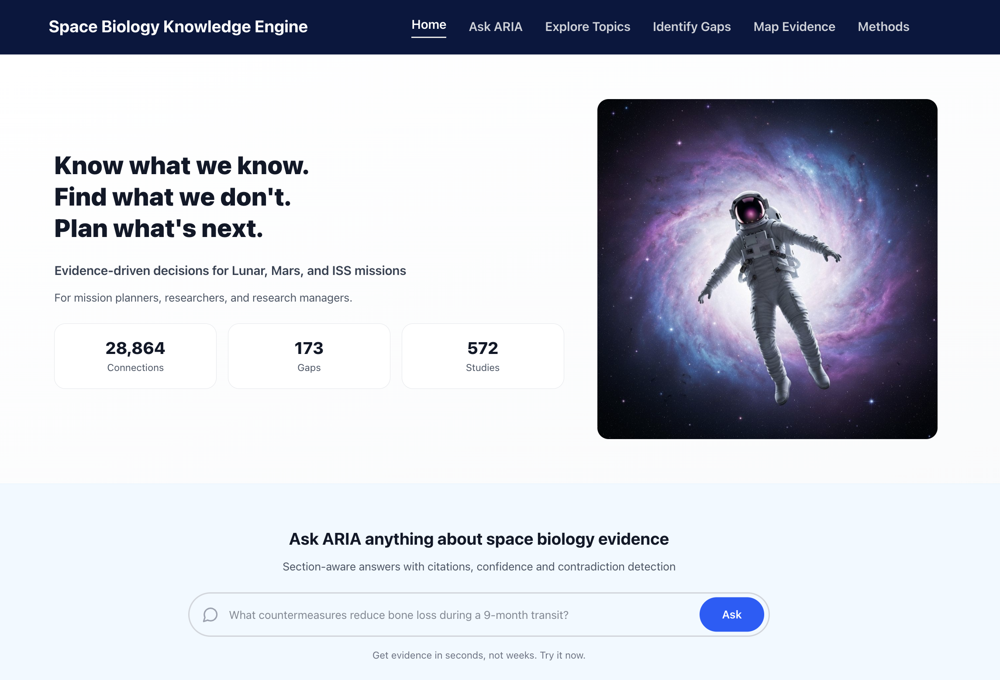
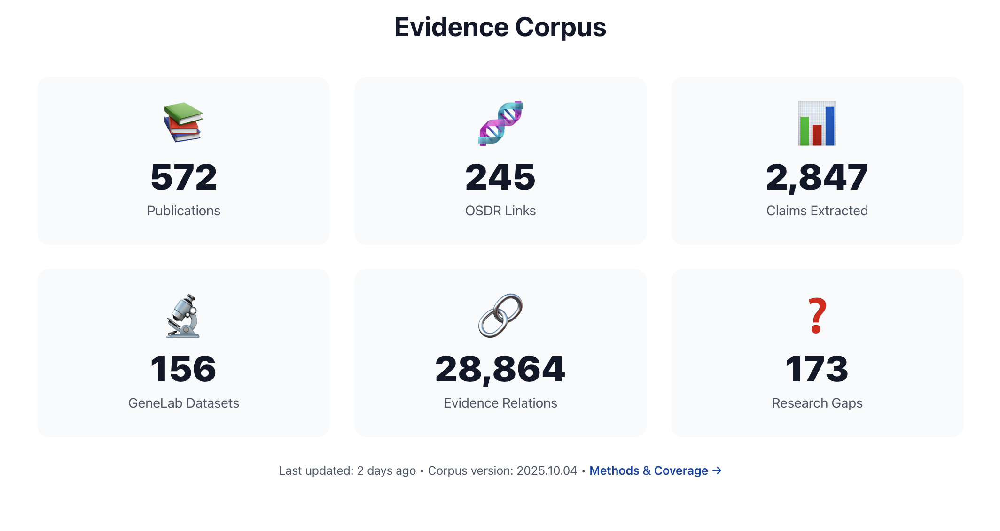
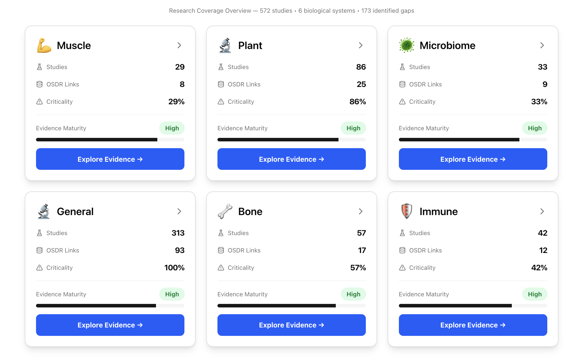
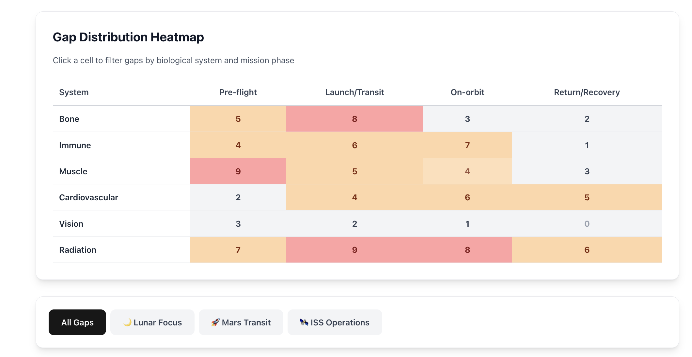
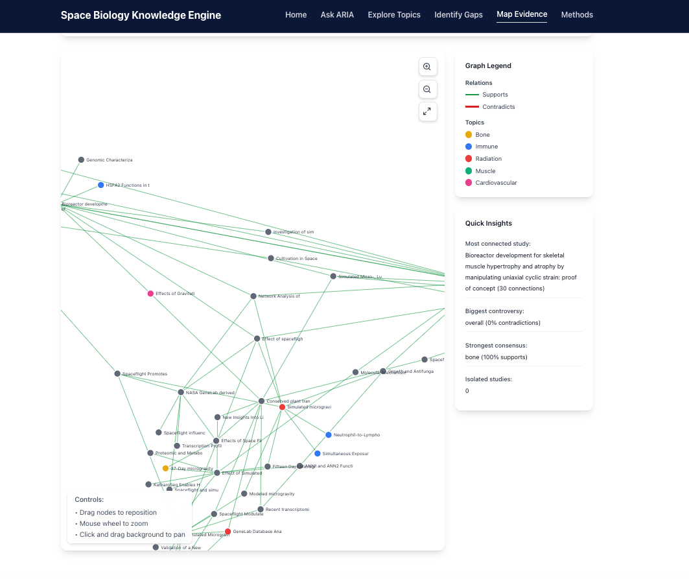

# LifeLens: Space Biology Knowledge Engine

LifeLens is an evidence-first knowledge engine for exploring NASA space biology literature.

It transforms a fragmented corpus of research papers, datasets, and project records into a searchable decision-support tool for scientists, mission planners, and research managers. Rather than manually reviewing hundreds of papers to understand what is known, where evidence is weak, and where findings conflict, users can query the corpus in natural language and inspect traceable evidence, research gaps, and contradictions in one place.

**Live demo:** https://www.spacebioengine.study/

## Screenshots

### Homepage


*Homepage showing the product entry point, mission-focused positioning, and headline evidence metrics.*

### Evidence corpus


*Corpus overview showing publication coverage, linked NASA datasets, extracted claims, and mapped evidence relations.*

### Evidence detail


*Topic-specific evidence view with section tags, confidence labels, and traceable source links.*

### Gap analysis


*Gap distribution heatmap showing research gaps by biological system and mission phase.*

### Knowledge graph


*Interactive evidence graph showing support and contradiction relationships across the literature.*

## Why this project exists

NASA space biology research spans bone loss, immune function, radiation response, muscle atrophy, and cardiovascular effects across ISS, Shuttle, and analogue missions. Although much of this research is publicly available, it remains difficult to synthesise quickly and consistently for decision-making.

This creates recurring problems:

- literature review for a single biological question can take weeks
- contradictory findings are easy to miss
- research gaps are rarely identified systematically across the corpus
- evidence from ISS does not transfer cleanly to Lunar or Mars scenarios
- each new analyst often starts from scratch

LifeLens was built to make this evidence easier to retrieve, validate, connect, and act on.

## Core capabilities

### Section-aware evidence retrieval

LifeLens classifies content by scientific section structure rather than treating all text equally. This improves retrieval quality by distinguishing factual findings from background context, methods, or author interpretation.

Search supports two modes:

- **Passage mode** for section-level evidence spans with section tags, confidence scores, and direct PMC links
- **Document mode** for full-paper retrieval ranked by relevance

### Automated gap identification

The platform mines Discussion sections to identify explicit research gaps, unresolved findings, and areas requiring further investigation.

Each extracted gap is enriched with:

- topic classification
- organism type
- priority score
- severity level
- mission relevance

### Evidence relation graph

LifeLens extracts structured claims and maps support and contradiction relationships across the corpus. This helps surface:

- areas of strong consensus
- contested topics
- isolated findings that may need replication
- cross-species translation paths

### Mission-centric evidence assessment

The platform helps assess whether evidence generated in one mission context is applicable to another, including:

- ISS operations
- Lunar stays
- Mars transit

### Topic-specific evidence pages

Each biological domain includes dedicated views showing:

- study counts
- linked datasets
- top claims
- support vs contradiction patterns
- organism distribution
- traceable evidence tables

## Data and scale

The current prototype processes a substantial subset of NASA space biology literature and related resources:

- **572** full-text publications processed
- **2,165** section-level evidence spans extracted
- **173** research gaps identified
- **1,092** structured claims extracted
- **28,864** evidence relations mapped
- **245** OSDR dataset links
- **156** GeneLab dataset links
- **87** NASA Task Book cross-references

The system is deployed as a working web application with sub-2-second query latency across the processed corpus.

## Technical highlights

This project combines applied AI, NLP, retrieval, and data engineering techniques to support evidence discovery and synthesis.

Key technical elements include:

- section-aware semantic retrieval across scientific documents
- vector embeddings for passage and document search
- PostgreSQL + pgvector for similarity search
- rule-based IMRaD section classification
- structured claim extraction from scientific text
- support / contradiction relation mapping
- research gap mining from Discussion sections
- cross-referencing papers with OSDR, GeneLab, and Task Book resources
- confidence scoring based on study count, section quality, recency, and source quality

## Technical approach

### Processing pipeline

1. Ingest full-text XML papers via PMC using provided PMCIDs  
2. Parse document structure including title, abstract, sections, and references  
3. Classify sections using IMRaD-style rules and heuristics  
4. Generate embeddings for semantic retrieval  
5. Extract structured claims from the corpus  
6. Detect support and contradiction relations  
7. Mine Discussion sections for explicit research gaps  
8. Cross-reference publications with OSDR, GeneLab, and Task Book resources  

### Stack

- **Frontend:** Next.js 14, TypeScript, Tailwind CSS
- **Database:** Supabase / PostgreSQL with pgvector
- **Visualisation:** D3.js
- **NLP:** spaCy plus custom rule-based processing
- **Deployment:** Vercel

## Trust, validation, and design choices

LifeLens is designed as an evidence-support tool, not a black-box answer engine.

Key design choices include:

- **traceable citations:** every claim links back to source material
- **section-aware retrieval:** Results, Methods, Discussion, and contextual content are treated differently
- **confidence scoring:** evidence is weighted using study count, section quality, recency, and journal tier
- **human validation:** section classification, claim extraction, and gap outputs were manually checked on samples
- **deterministic scientific processing:** generative AI was not used for scientific text extraction, section classification, or claim validation

The goal is not just speed, but speed with transparency and inspectability.

## My contribution

This project was built by **Team LifeLens** for the NASA Space Apps challenge.

My contribution focused on the core AI and data architecture, including:

- vector search architecture for section-level and document-level retrieval
- NLP pipeline design for scientific text processing
- knowledge graph design for support and contradiction mapping
- evidence structuring to improve traceability and scientific usability

The broader team combined backend, frontend, biology, design, and UX expertise to build a multidisciplinary prototype.

## Limitations

This is a hackathon prototype designed to demonstrate feasibility, not a finished production platform.

Current limitations include:

- the corpus is limited to the challenge dataset rather than the full NASA archive
- section classification is not perfect on all paper structures
- claim extraction captures explicit statements better than implicit findings
- contradiction detection still requires expert review
- gap extraction identifies explicit Discussion-section gaps more reliably than inferred absences in the literature
- cross-species relevance is surfaced, but not automatically adjudicated

## Next steps

Planned improvements include:

- expanding the corpus
- improving evaluation and validation workflows
- supporting real-time updates as new papers are published
- exposing an API for integration with external tools
- adding experiment design support linked to identified gaps
- improving mission-specific reasoning and transferability analysis

## Repository contents

```text
app/            Next.js routes and pages
components/     UI components
lib/            core logic and utilities
scripts/        data and processing scripts
docs/           project and architecture notes
public/         static assets
types/          shared TypeScript types
